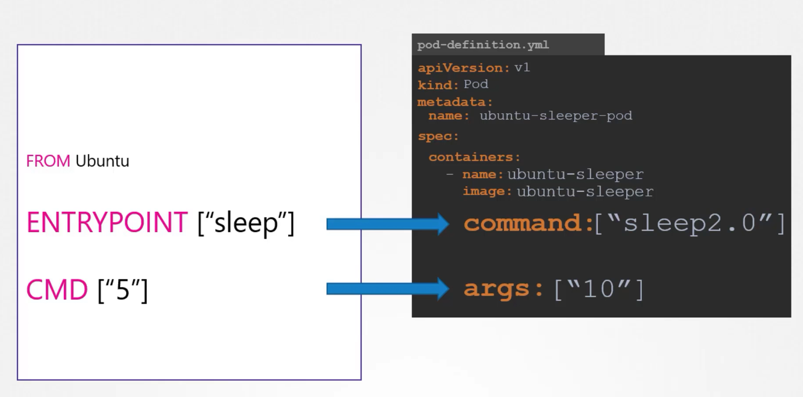
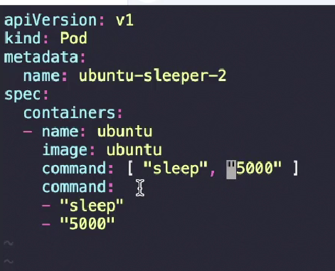
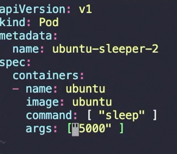

```bash

$ docker run ubuntu
$ docker ps
$ docker ps -a # too see all containers that even stopped

$ docker run ubuntu [CMD]
$ docker run ubuntu sleep 5


# cmd as it is in shell for or as a json format

# shell form
# $ CMD command param
$ CMD sleep 5

# json-array form
# $ CMD ["command","param"]
$ CMD ["sleep","5"]

```
```
FROM ubuntu

ENTRYPOINT ["sleep"]

CMD ["5"]
```
SO in the above case if we don't fprovide the arg it will still work
```bash
$ docker run ubuntu-sleeper 10
$ docker run ubuntu-sleeper # here as cmd is 5 it will be default input as no input provide
```

### To override entrypoint and cmd in dockerworld

```bash
# to override entrypoint in dockerworld

$ docker run --name ubuntu-sleeper --entrypoint sleep2.0 ubuntu-sleeper 10

```

$ kubectl replace --froce -f <temp-file>
But in Kubernetes world, to modfiy entrypoint in dockerfile we modify commandmd in pod-def.yml and to modify cmd in dockerfile we modify args in pod-fe.yml




$ kubectl run nginx --image nginx -- --color-greens