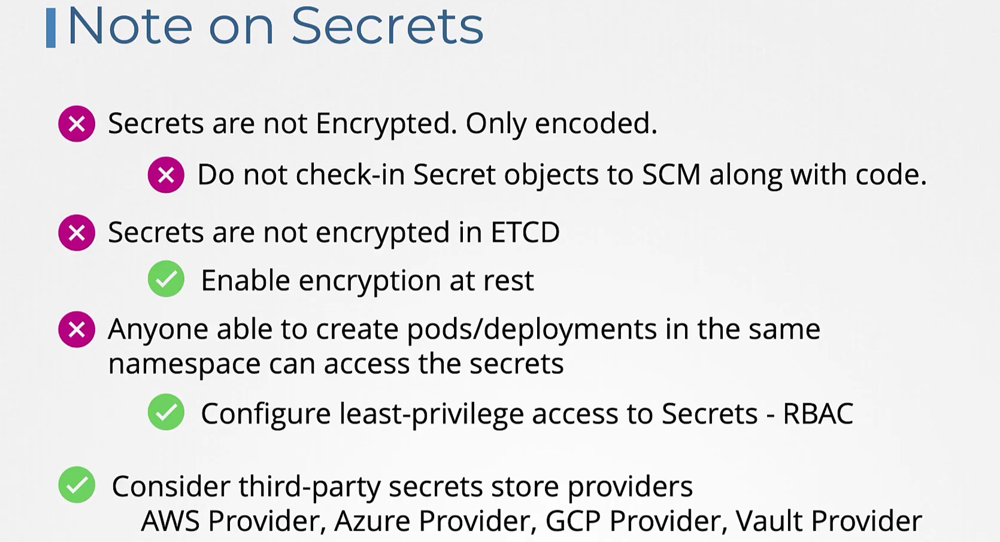

## Setting Env variables in K8


#### Direct way of setting env variables

```yaml
apiVersion: v1
kind: Pod
metadata:
  name: my-pod
spec:
  containers:
  - name: mycontainer
    image: myimage:latest
    env:
    - name: App_color
      value: green
 
```

## ConfigMap

1. create config maps
2. inject configmap into pods

#### creating configmap can be acheived in 2 ways:
1. **Imperative way**
```bash
$ kubectl create configmaps <config-name> --from-literal=<key>-=<value>

$ kubectl create configmap  webapp-config-map --from-literal=APP_COLOR=darkblue --from-literal=APP_OTHER=disregard
$ kubectl create configmaps app-cnfig --from-literal=APP_COLOR=blue

# creating config maps using a file

$ kubectl create configmaps <config-name> --from-file=<path-of-file>
```
2. **Declarative way**
```bash 
$ kubectl create f 
```
manifest file for creating configmap
```yaml
apiVersion: v1
kind: configMap
metadata:
  name: app-config
data:
  APP_COLOR: blue
  APP_MODE: prod
```
```bash
$ kubectl create -f config-map.yml

$ kubectl get configmaps
$ kubectl describe configmaps
```
#### configuring it to a pod
```yaml
apiVersion: v1
kind: Pod
metadata:
  name: my-pod
  labels:
    tier: frontend
spec:
  containers:
  - name: mycontainer
    image: myimage:latest
    ports:
      - containerPort: 8080
    envFrom:
      - configMapRef:
          name: app-config # name of the configmap created above
```
```bash 
$kubectl replace --force -f /tmp/kubectl-edit-969739747.yaml
```
#### Update the environment variable on the POD to use only the APP_COLOR key from the newly created ConfigMap.


Note: Delete and recreate the POD. Only make the necessary changes. Do not modify the name of the Pod.

```yaml
---
apiVersion: v1
kind: Pod
metadata:
  labels:
    name: webapp-color
  name: webapp-color
  namespace: default
spec:
  containers:
  - env:
    - name: APP_COLOR
      valueFrom:
       configMapKeyRef:
         name: webapp-config-map
         key: APP_COLOR
    image: kodekloud/webapp-color
    name: webapp-color
```

```bash
$ kubectl replace --force -f <tempfile>
```
## Secrets

In k8 we store sensetive data like passwords into secrets.
There are 2 steps invvolved into Secrets.

**1. Creating Secret**
- 2 ways to create secret one is **Imperative way** and another is **Decrative way**.

- **Imperative way:**
```bash
$ kubectl create secret generic <secret-name> --from-literal=<key>=<value>

$ kubectl create secret generic app-secret --from-literal=DB_HOST=mysql

# creating multiple secrets imperatively
$ kubectl create secret generic app-secret --from-literal=DB_HOST=mysql --from-literal=DB_Owner=ms_dev

# creating secret from a file
$ kubectl create secret generic <secret-name> --from-file=<file-path>

$ kubectl create secret generic app_secret --from-file=app_secrets.properties
```

- **Declarative way**
```yaml
apiVersion: v1
kind: Secret
metadata:
  name: my-secret
type: Opaque
data:
  username: dXNlcm5hbWU=   # base64 encoded 'username'
  password: cGFzc3dvcmQ=   # base64 encoded 'password'
```
🔐 Notes:
The values in data: must be base64 encoded.

For example:

```bash

# Encoding a secrete
echo -n 'username' | base64    # outputs: dXNlcm5hbWU=
echo -n 'password' | base64    # outputs: cGFzc3dvcmQ=

# decoding a secret

echo -n 'password' | base64 --decode
```
**type: Opaque** is used for generic secrets. There are other types like kubernetes.io/dockerconfigjson, etc.
```bash
$ kubectl apply -f secret.yaml

# list the secrets
$ kubectl get secret #but this prints the values as hidden ones

$ kubectl get secret app-secret -o yaml # app-secret is secret file name

# view the secret
$ kubectl describe secrets
```
**2. Injecting Secrets into Pods**
```yaml
apiVersion: v1
kind: Pod
metadata:
  name: mypod
spec:
  containers:
  - name: mycontainer
    image: alpine
    command: ["sh", "-c", "env && sleep 3600"]
    env:
    - name: SECRET_USERNAME
      valueFrom:
        secretKeyRef:
          name: my-secret
          key: username
    - name: SECRET_PASSWORD
      valueFrom:
        secretKeyRef:
          name: my-secret
          key: password
```
or
```yaml
apiVersion: v1
kind: Pod
metadata:
  name: mypod
spec:
  containers:
  - name: mycontainer
    image: alpine
    command: ["sh", "-c", "env && sleep 3600"]
    envFrom:
    - secretRef:
        name: app-secret
```
3 ways to inject secrets


