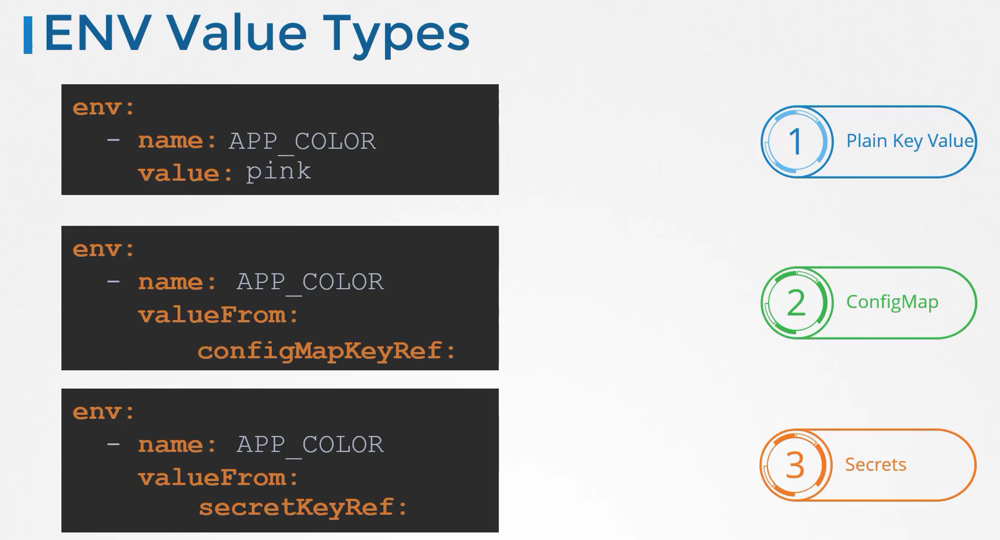

## Setting Env variables in K8


#### Direct way of setting env variables

```yaml
apiVersion: v1
kind: Pod
metadata:
  name: my-pod
spec:
  containers:
  - name: mycontainer
    image: myimage:latest
    env:
    - name: App_color
      value: green
 
```

## ConfigMap

1. create config maps
2. inject configmap into pods

#### creating configmap can be acheived in 2 ways:
1. **Imperative way**
```bash
$ kubectl create configmaps <config-name> --from-literal=<key>-=<value>

$ kubectl create configmap  webapp-config-map --from-literal=APP_COLOR=darkblue --from-literal=APP_OTHER=disregard
$ kubectl create configmaps app-cnfig --from-literal=APP_COLOR=blue

# creating config maps using a file

$ kubectl create configmaps <config-name> --from-file=<path-of-file>
```
2. **Declarative way**
```bash 
$ kubectl create f 
```
manifest file for creating configmap
```yaml
apiVersion: v1
kind: configMap
metadata:
  name: app-config
data:
  APP_COLOR: blue
  APP_MODE: prod
```
```bash
$ kubectl create -f config-map.yml

$ kubectl get configmaps
$ kubectl describe configmaps
```
#### configuring it to a pod
```yaml
apiVersion: v1
kind: Pod
metadata:
  name: my-pod
  labels:
    tier: frontend
spec:
  containers:
  - name: mycontainer
    image: myimage:latest
    ports:
      - containerPort: 8080
    envFrom:
      - configMapRef:
          name: app-config # name of the configmap created above
```
```bash 
$kubectl replace --force -f /tmp/kubectl-edit-969739747.yaml
```
#### Update the environment variable on the POD to use only the APP_COLOR key from the newly created ConfigMap.


Note: Delete and recreate the POD. Only make the necessary changes. Do not modify the name of the Pod.

```yaml
---
apiVersion: v1
kind: Pod
metadata:
  labels:
    name: webapp-color
  name: webapp-color
  namespace: default
spec:
  containers:
  - env:
    - name: APP_COLOR
      valueFrom:
       configMapKeyRef:
         name: webapp-config-map
         key: APP_COLOR
    image: kodekloud/webapp-color
    name: webapp-color
```

```bash
$ kubectl replace --force -f <tempfile>