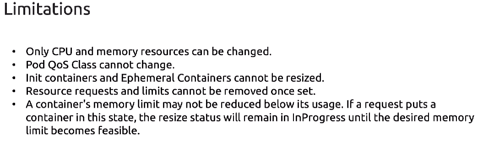

## Scaling in Kuberenetes

1. Vertical Scaling
- Increase the capicity of server that is running the workload as of now by increasing their memory and cpu capacity. it includes a bit of downtime.
  
1. Horizontal Scaling
  - In this we do spin up similar instances of our app and using loadbalancer or some other services we redirects the app load.

#### Note: As Vertical scaling might involve bit downtime so in k8's mostly we do horizontal scalling.

## In k8's we can scale 2 things
1. Cluster scalling ( Maybe vertical or horizontal ) - basically scalling cluster infra
2. Workload scalling - basically scalling our pods which is running workloads.

Note: we can perform this scalling both in manual and automated way.


```bash

# manually scalling
$ kubectl top pod my-pod
$ kubectl scale deployment my-deploy --replicas 8

```

## HPA (Horizontal Pod Autoscaller) - To scale automatically and horizontally 


#### Imperative way to create hpa
```bash

# create hpa
$ kubectl autoscale deployment my-deploy --cpu-percent 50 --min 1 --max 10

# status of hpa
$ kubectl get hpa

# delete hpa
$ kubectl delete hpa my-hpa
```
Note: Hpa is built-in in k8s from version 1.23 so not seprate installation is required

Hpa can use internal and external data sources of metrics to make scaling decisions


#### Declarative way

```yaml
apiVersion: autoscaling/v2
kind: HorizontalPodAutoscaler
metadata:
  name: myapp-hpa
spec:
  scaleTargetRef:
    apiVersion: apps/v1
    kind: Deployment
    name: myapp
  minReplicas: 2
  maxReplicas: 5
  metrics:
  - type: Resource
    resource:
      name: cpu
      target:
        type: Utilization
        averageUtilization: 50
```

Key Points:
- **scaleTargetRef**: References the deployment or resource the HPA will scale.

- **minReplicas** and **maxReplicas**: Define the scaling boundaries.

- **metrics**: You can scale based on CPU, memory, or custom metrics. This example uses CPU utilization (50%).

``` bash
$ kubectl apply -f hpa.yml

$ kubectl events hpa nginx-deployment | grep -i "FailedGetResourceMetric"
```



## Vertical Pod Autoscaler (VPA)

Unlike HPA, VPA doesn't come built in we have to manually install this one.


The Vertical Pod Autoscaler (VPA) in Kubernetes automatically adjusts the CPU and memory requests and limits for your pods based on observed usage, ensuring optimal resource allocation over time.

####  🔍 What VPA Does:
- Monitors resource usage of pods.

- Recommends better resource requests.

- Applies changes automatically (if configured to do so).

- Helps prevent overprovisioning and underutilization.

| Component                | Description                                               |
| ------------------------ | --------------------------------------------------------- |
| **Recommender**          | Observes usage and suggests better resource requests.     |
| **Updater**              | Evicts pods if required to apply the new recommendations. |
| **Admission Controller** | Sets resource values during pod creation.                 |

## ✅ VPA Modes:
| Mode      | Behavior                                                 |
| --------- | -------------------------------------------------------- |
| `Off`     | Only gives recommendations (no changes applied).         |
| `Initial` | Sets recommendations only when the pod is first created. |
| `Auto`    | Continuously updates pods (may involve pod restarts).    |


#### Installation guide
```bash
#Clone the VPA GitHub repository (optional)
$ git clone https://github.com/kubernetes/autoscaler.git
$ cd autoscaler/vertical-pod-autoscaler/

# Apply the VPA deployment manifests
$ kubectl apply -f https://github.com/kubernetes/autoscaler/releases/latest/download/vertical-pod-autoscaler.yaml

# verify installation
$ kubectl get pods -n kube-system | grep vpa

$ kubectl describe vpa my-vpa
```


