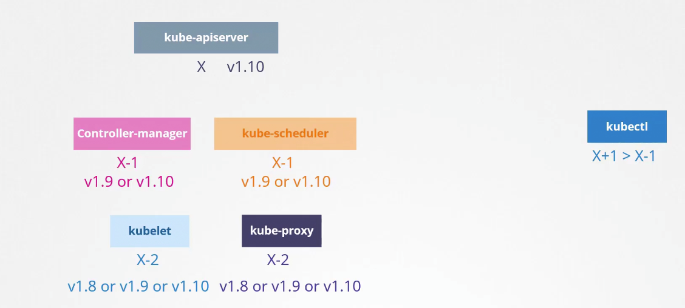
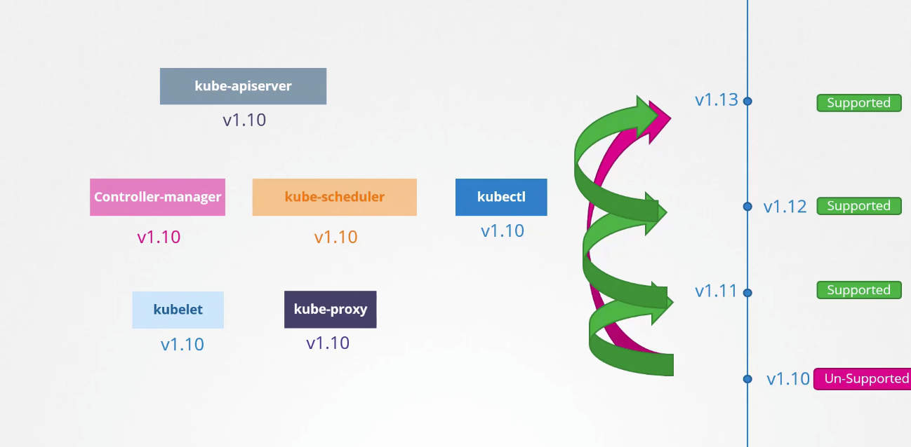

## Clusture upgrade 

In k8, there are different components and it's possible that every component might have different versions.

As kube-api-server is one of the main component and one with which every external api or user interacts with it's important that it have 1 higher version then rest of component or in other words rest of component must have lower version than the kube-api-server.

only kubectl is allowed to have 1 higher or lower version than the kube-api-server.

This skew in versions allow us to update k8 cluster component by component it means we can simply make upgrades to our cluster on component to component basis.

at a time, with latest release of k8 version kubernetes only allows support for only 3 immediate version.

so if latest version is v1.33.1, then kubernetes will support v1.32 and 1.31 only.

while upgrading our cluster it's recommended to update 1 minor version at a time instead of immediate update to the most latest one this is a safest and recommended approach.